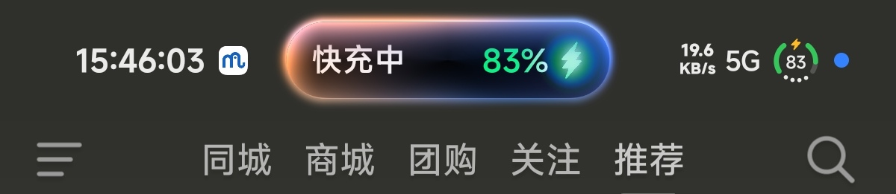
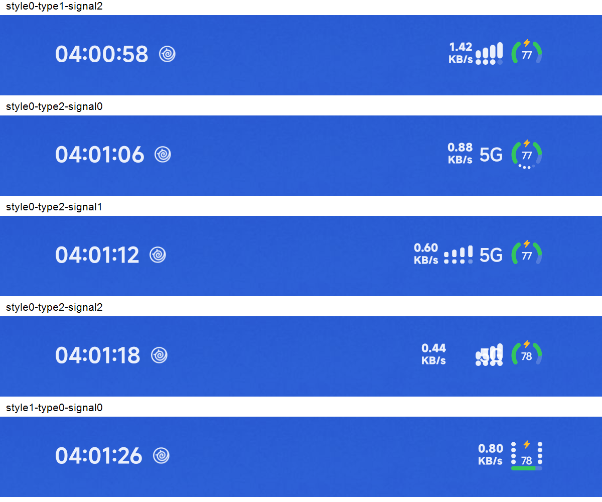
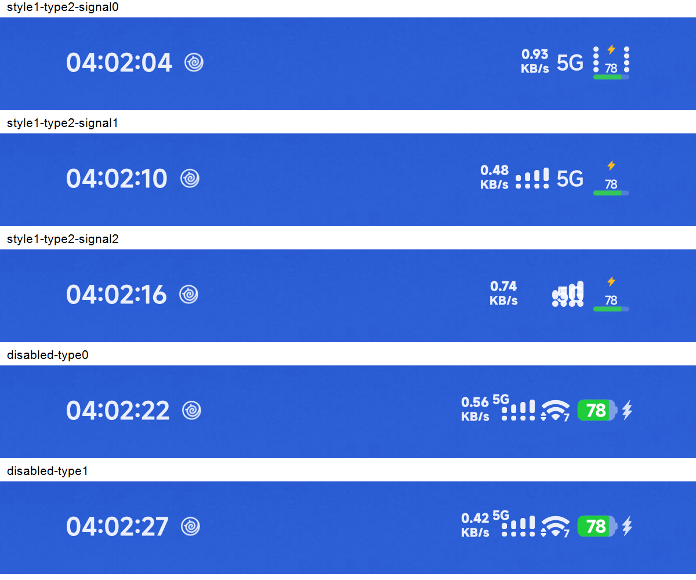

# Issue #9: native network-type leakage and charging-island regression

## Cause and changes

The ROM's classic `mobile_type` ImageView can be made visible directly by its
binder, bypassing `MobileSignalAnimatorContainer.setChildVisible`. Its dedicated
`MobileTypeDrawable.draw` draws text without checking its bounds. Collapsing the
ignored parent slot to zero size alone therefore does not reliably suppress it.

- Gate that dedicated drawable only when HyperDuo is enabled and supplies an
  out-of-ring network-type label. Leave sampling and measurement untouched.
- Settle the native slots when a host is registered, without waiting for another
  layout; avoid generating disappearance clones when suppressing native labels.
- Honor an existing custom signal view as the type label's anchor, instead of
  placing both views at the same icon-row edge.
- Preserve the complete glyph during a charging island by overriding only the
  battery replacement request. Leave the island window and clearance behavior
  alone. Retain the real request for configuration replay and stock behavior
  when the module is disabled.

## Verification

Run the following in PowerShell 7 with `java` and `javac` on PATH:

```powershell
./tests/issue9-startup.ps1
./tests/issue9-animation.ps1
./tests/issue9-draw.ps1
./tests/issue9-island.ps1
./tests/issue9-keep-island.ps1
```

These execute extracted production methods with small Java stubs; they are not
Android instrumentation tests. Generated files stay in ignored `work/issue9`.

| Coverage | Result |
| --- | --- |
| Startup control flow | 7 cases passed |
| Animator disappearance branches | 6 cases passed |
| Draw gate and registration | 8 cases passed |
| LTR/RTL placement, island translation, solo label | 4 cases passed |
| Battery request forwarding, saved state, enable/disable replay | 11 cases passed |
| Issue #9 after SystemUI restart and full device reboot | Verified during device iteration |
| Final charging-island appearance | User confirmed on test6 |
| All mode combinations on final build | Not completed |
| Final cleaned test6 installed on device | Reinstalled; user confirmed normal runtime and functionality |

Device validation used the Xiaomi 17 Pro Max / HyperOS 4 ROM reported in #9.
Earlier variants did not fix the problem; full-reboot verification preceded the
final charging-island changes. Cross-ROM compatibility, rotation and exhaustive
mode transitions still require device testing. No raw device logs, screenshots,
or decompiled platform source are included.

## Final test6 charging-island screenshot

The user supplied this cropped device screenshot after confirming normal runtime
and functionality on the reinstalled, diagnostics-cleaned test6 build. It shows
the charging island alongside the complete HyperDuo battery glyph, with the 5G
label visibly separated from the glyph. The image is included unchanged.



This is evidence for the pictured charging-island state, not an exhaustive
mode-transition, rotation or cross-ROM test. Earlier test4 contact sheets remain
in Git history but are replaced here to avoid confusing them with final results.

## Historical mode-combination tests (test4)

These supplementary images retain the earlier ring/rectangular and disabled-mode
checks. They predate the test5 anchor correction and test6 island behavior, so
visible overlap in these images is historical, not the final result. They do
not establish that all combinations passed on the final build.




